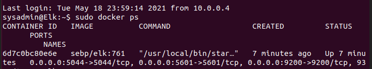

Automated ELK Stack Deployment

The files in this repository were used to configure the network depicted below.

These files have been tested and used to generate a live ELK deployment on Azure. They can be used to either recreate the entire deployment pictured above. Alternatively, select portions of the file may be used to install only certain pieces of it, such as Filebeat or Metricbeat.

 - 
 - 
 - 

This document contains the following details:
- Description of the Topology
- Access Policies
- ELK Configuration
  - Beats in Use
  - Machines Being Monitored
- How to Use the Ansible Build

Description of the Topology

The main purpose of this network is to expose a load-balanced and monitored instance of DVWA, the D*mn Vulnerable Web Application.

Load balancing ensures that the application will be highly available, in addition to restricting access to the network.
- Load balancing is the process of efficiently distributing incoming network traffic across a group of backend servers. So in the event of attacks such as Denial of Service (DoS), load balancers will distribute the volume amongst the chosen serves mitigating any down time from the overload of information/packets being sent. 

Integrating an ELK server allows users to easily monitor the vulnerable VMs for changes to the files logs and system metrics.
- Filebeat is a logging agent that collects data about the file system and forwards the information to our Elk.
- Metricbeat is similar to filebeat in the sense that it collects data, however, it collects metrics and statitics and fowards the information.

The configuration details of each machine may be found below.

| Name     | Function | IP Address | Operating System |
|----------|----------|------------|------------------|
| Jump Box | Gateway  | 10.0.0.4   | Linux            |
| Web-1    | Server   | 10.0.0.5   | Linux            |
| Web-2    | Server   | 10.0.0.6   | Linux            |
| ELK      | Monitor  | 10.1.0.6   | Linux            |

Access Policies

The machines on the internal network are not exposed to the public Internet. 

Only the Jumpbox-Provisioner machine can accept connections from the Internet. Access to this machine is only allowed from the Admin IP through SSH

Machines within the network can only be accessed by Jumpbox-Provisioner.
- 10.0.0.4

A summary of the access policies in place can be found in the table below.

| Name     | Publicly Accessible | Allowed IP Addresses |
|----------|---------------------|----------------------|
| Jump Box | Yes                 | 10.0.0.1-8           |
| Web-1    | No                  | 10.0.0.1-8           |
| Web-2    | No                  | 10.0.0.1-8           |
| Elk      | No                  | 10.0.0.1-8           |

Elk Configuration

Ansible was used to automate configuration of the ELK machine. No configuration was performed manually, which is advantageous because...
- There will always be human error and it is the greatest risk in these processes. Using automation simplifies the process when using our ansible playbook. The ansible playbook will update all the applicalbe machines. 

The playbook implements the following tasks:
- Installs Docker, furthermore will install the containers
- Installs Python-pip
- Installs Docker python module
- Increases virtual memory
- Downloads and launces the docker ELK container with ports 5601, 9200 & 5044

The following screenshot displays the result of running `docker ps` after successfully configuring the ELK instance.

Target Machines & Beats
This ELK server is configured to monitor the following machines:
- Web-1 10.0.0.5
- Web-2 10.0.0.6

We have installed the following Beats on these machines:
- Filebeat
- Metricbeat

These Beats allow us to collect the following information from each machine:
- Filebeat collects data about the file system. It will detect changes in files and forward the information to our ELK. 
- Metricbeat collects metrics from the system. It will send metrics regarding the stae of the VM's and forward the information to our ELK.

Using the Playbook
In order to use the playbook, you will need to have an Ansible control node already configured. Assuming you have such a control node provisioned: 

SSH into the control node and follow the steps below:
- Copy the install-elk file to ansible container /etc/ansible.
- Update the hosts file to include our ELK server: 10.1.0.6
- Run the playbook install-elk.yml, and navigate to http://<VM-Ip:5601/app/kibana> to check that the installation worked as expected.

- The playbook file is install-elk.yml and is copied to /etc/ansible.
- Updating the host file will make Ansible run the the playbook on the specific machine.
- In order to navigate to kibana you need your Elk VM's public ip http://<VM-Ip:5601/app/kibana>
- You can run the playbook by running the command: ansible-playbook install-elk.yml
